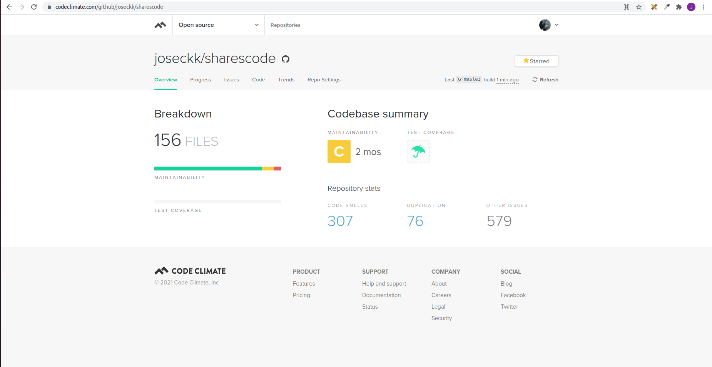
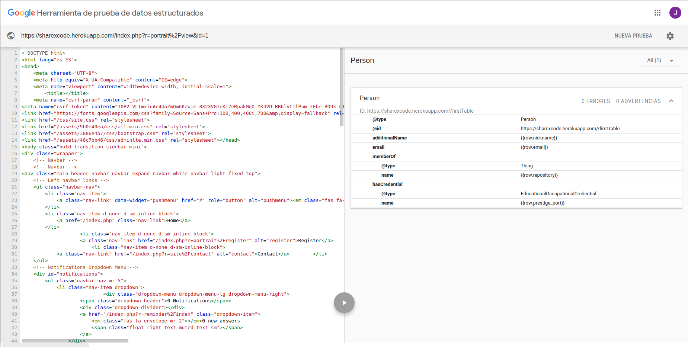
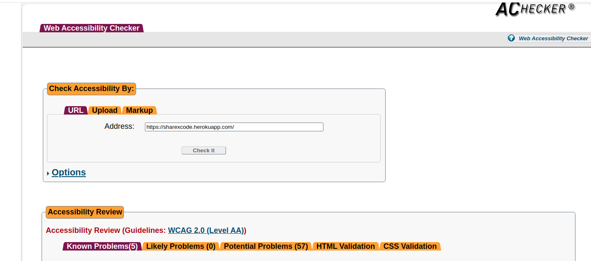
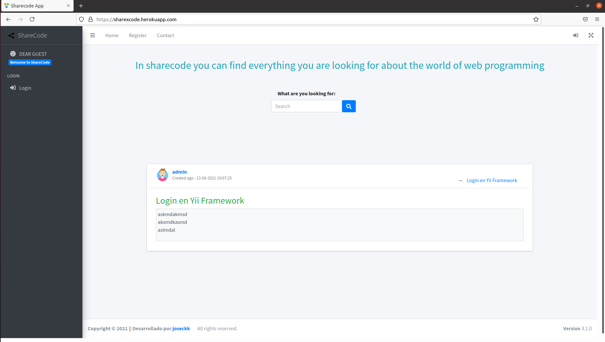
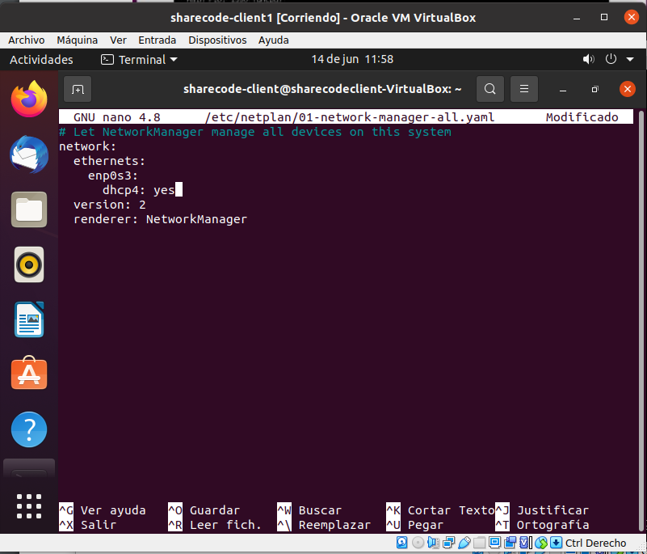
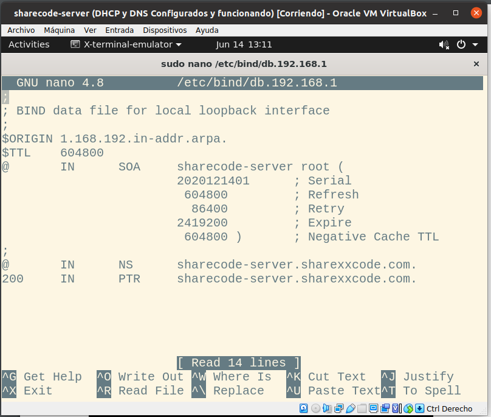
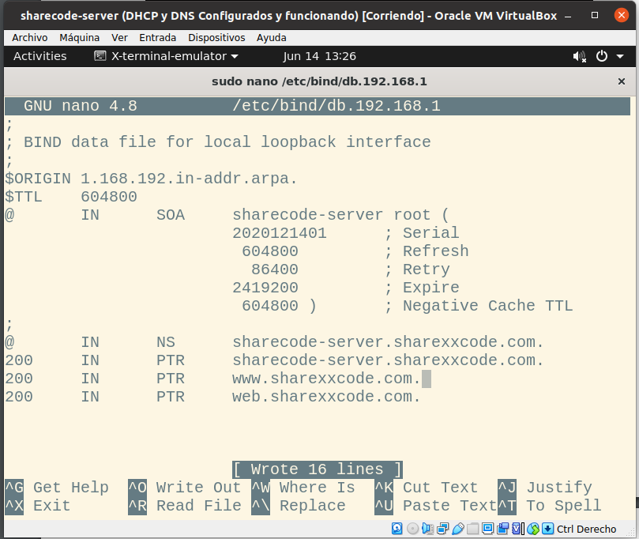
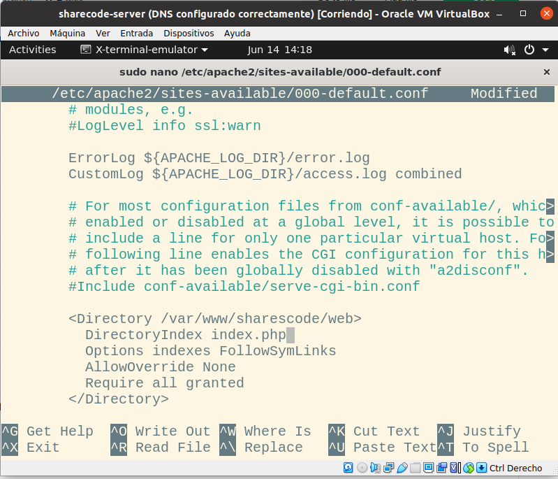

# Anexos

### Prueba del seis

 1. ¿Qué sitio es éste?
- La aplicación tiene en todo momento elementos indicativos de que sitio es. Arriba en la menú de navegación está en todo momento el logotipo de la aplicación. El menú de navegación y el pié de página se mantienen siempre, por lo que siempre está identificado el sitio.

 2. ¿En qué página estoy?
- Todas las páginas del sitio están identificadas por las migas de pan (excepto la inicial), lo que te sitúan en todo momento.

 3. ¿Cuales son las principales secciones del sitio?
- Las principales secciones del sitio son *Home*, *My Portrait* y *Contact* 

 4. ¿Qué opciones tengo en este nivel?
- La navegación de cada nivel se realiza mediante botones y enlaces para hacer uso de las diferentes acciones y pantallas.

 5. ¿Dónde estoy en el esquema de las cosas?
- En todas las páginas se muestra tanto el navbar como el sidebar que muestran todas las diferentes opciones de la web.

 6. ¿Cómo busco algo?
- En el inicio de mi sitio web aparece un buscador con el cual puedo localizar cualquier consulta creada.

---

### **([R25](https://github.com/joseckk/sharescode/issues/25)) Codeception**

---

### **([R26](https://github.com/joseckk/sharescode/issues/26)) Codeclimate**

---

### **([R33](https://github.com/joseckk/sharescode/issues/33)) Uso de microdatos**

---

### **([R34](https://github.com/joseckk/sharescode/issues/34)) Validación HTML5, CSS3 y accesibilidad**
---
### Validación de HTML y CSS

**HTML**

**CSS**

**Accesibilidad**

---

### **([R36](https://github.com/joseckk/sharescode/issues/36)) Varios navegadores**

#### **Google Chrome**

---

#### **Mozilla Firefox**

---

#### **Opera**

---

### **([R38](https://github.com/joseckk/sharescode/issues/38)) Despliegue en servidor local**

Configuración del servicio DHCP en el server:

Configuración del servicio DHCP en el cliente:

Configuración del servicio DNS en el server:

* Creando las zonas en named.conf.local.

* Creando el fichero de configuración de la zona directa.

* Creando el fichero de configuración de la zona inversa.

Configuración del servicio Apache en el server:

* Nueva configuración del netplan.

* Cambios en la configuración de la zona directa.

* Cambios en la configuración de la zona inversa.

* Ahora configuraremos el fichero de sites-available para poner la ruta del proyecto y configurar directivas.

* Por último comprobaremos que al fin está desplegada nuestra aplicación desde la maquina cliente.

