# Manual de usuario

### Página de inicio (sin iniciar sesión)
La página de inicio dispone de un sidebar a la izquierda que en este caso al ser invitado aparecen el logotipo del sitio web seguido del nombre y la opción para loguearse, luego en el navbar; a la izquierda nos mostrara el sidebar como menu "Hamburguesa", seguido de los enlaces "Home", "Register" y "Contact", después a la derecha dos botones; "Logout" seguido del "Fullscreen" encargado de poner la app en tamaño completo.

Centrandonos ahora en el contenido central; Debajo de la pequeña introducción aparecerá un buscador global con el que encontrar la consulta exacta deseada. Luego el cuerpo de la consulta, con su título y contenido seguido de las respuestas a esa consulta, en el caso que algun usuario halla respondido. 

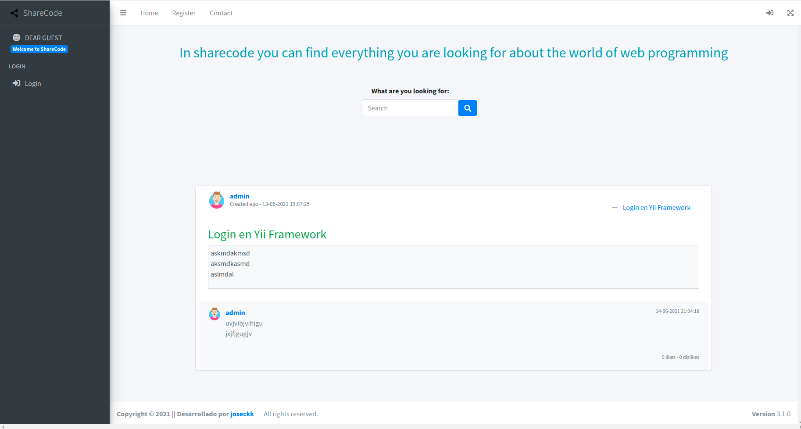

***

### Página de inicio (sesión iniciada por administrador)
Una vez logueado como administrador a la izquierda el sidebar cambia completamente, al cual se le añaden varias opciones; primero el avatar del administrador seguido de su nickname, luego "Suggestions Mailbox" (buzón de sugerencias), "User profiles" (Perfiles de los usuario), "User List" (Lista de usuario), "Create Users" (Creación de usuarios), "Create Query" (Creación de consulta) y "Answers List" (Lista de respuesta del propio usuario).

En el navbar; a la derecha aprecen los enlaces siguientes; enlace "Home", "My Portrait" (Mi perfil), "Contact" (Contacta con nosotros) y la campana de las notificaciones. Luego a la derecha se mantiene el "Logout" y el "Fullscreen".

***

### Página de inicio (sesión iniciada por usuario)
Una vez logueado como usuario a la izquierda el sidebar cambia completamente, al cual se le añaden varias opciones; primero el avatar del usuario seguido de su nickname, luego "Prestige" (Prestigio del usuario) seguido del nivel de prestigio a la derecha, "Create Query" (Creación de consulta), "Answers List" (Lista de respuesta del propio usuario) y "User profiles" (Perfiles de los usuario).

En el navbar; a la derecha aprecen los enlaces siguientes; enlace "Home", "My Portrait" (Mi perfil), "Contact" (Contacta con nosotros) y la campana de las notificaciones. Luego a la derecha se mantiene el "Logout" y el "Fullscreen".

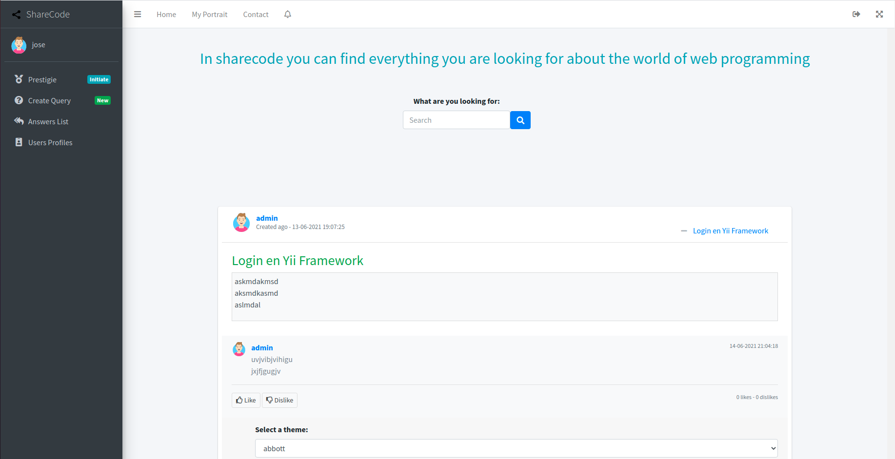

***

### Página de Logueo
Esta página muestra un formulario de acceso a usuarios registrados, con dos opciones "I forgot my password" para aquellos usuario que olvidaron su contraseña puedan recuperarla y "Register a new membership" que nos envía a la página de registro de usuario.

***

## Página de perfil
Una vez logueado, en el caso de que sea nuestra propia página de perfil veremos dos botones; "delete" (borrar mi perfil) y "update" (modificar perfil), luego veremos la imagen de nuestro avatar y por último una tabla que contiene los siguientes datos:
* El "nickname" (apodo) del usuario.
* El "date register" (fecha de registro) del usuario.
* El "e-mail" del usuario.
* El "repository" (repositorio de cualquier sistema de control de versiones) del usuario.
* El "prestige port" (prestigio) del usuario.
* El "sex" (sexo) del usuario.

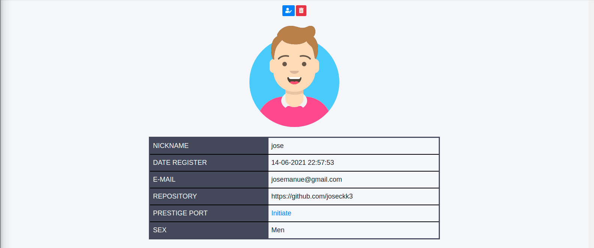

***

### Página "Prestigie"
Una vez accedamos a cualquier página de prestigio del usuario nos mostrará las siguientes características:
* El "title" (el nivel de prestigio) del usuario.
* La "antiquity" (antigüedad) del usuario.
* La "Puntuation" (puntuación) del usuario.

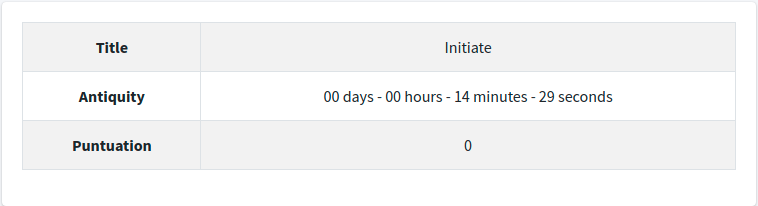

***

### Página  "Create query"
En esta página tendremos un formulario con dos campos para agregar tanto el título como el contenido de la consulta, seguido del botón para crearla.

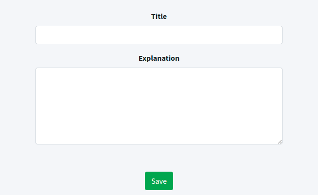

***

### Página  "Answers List"
Se mostrará una tabla con todas las respuestas que hemos realizado en el sitio web, con la información siguiente:
* El "title" (título) de la consulta que responde.
* El "nickname" (apodo) del usuario que crea la respuesta.
* Una barra de acciones para ver, modificar o eliminar la respuesta.

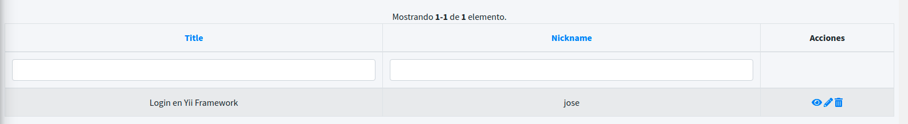

***

### Página  "Answer"
Se mostrarán dos botones para modificar o borrar la respuesta y un campo con el contenido de la misma.

***

### Página "Users Profiles"
Se mostrará una tabla con todos los perfiles del sitio web, con la información siguiente:
* El "nickname" (apodo) del usuario.
* El "date register" (fecha de registro) del usuario.
* El "e-mail" del usuario.
* El "repository" (sistema de control de veriones) del usuario.
* El "prestige port" (prestigio) del usuario.
* El "sex" (sexo) del usuario.
* Una barra de acciones con la opción de ver el perfil de ese usuario en concreto.

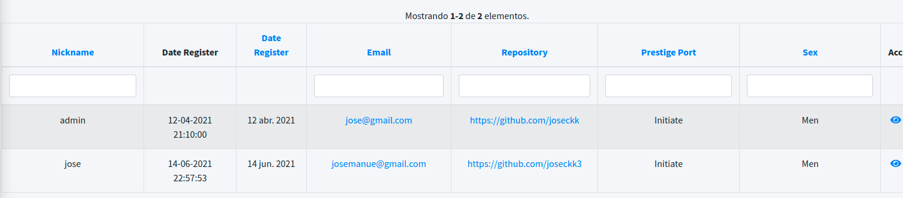

***

### Página "Votes"
Esta página muestra la valoración general de la web junto con todas las sugerencias (valoración (typ), comentario (suggesting) y puntuación (puntuation)) de los usuarios.

***

### Página para crear una valoración "Assessment" 
En el caso de que nuestra antigüedad sea inferior a un día, podemos crear una valoración.

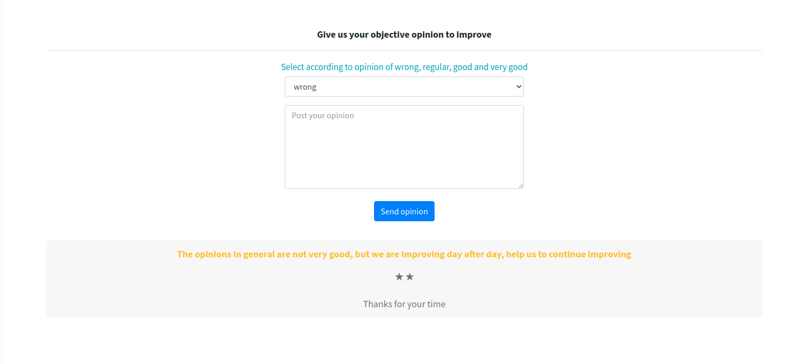

***

### Página "Users List"
Esta página es solo accesible para los administradores, cuenta con una tabla que muestra la lista de usuarios del sitio web.

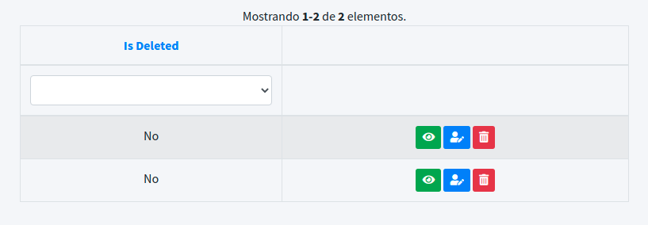

***

### Página "Create Users"
Esta página es solo accesible para los administradores y solo hay que rellenar el formulario.

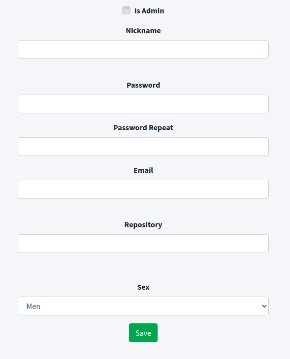

***

### Página "Register"
Esta página es accesible por el usuario invitado y solo hay que rellenar el formulario.

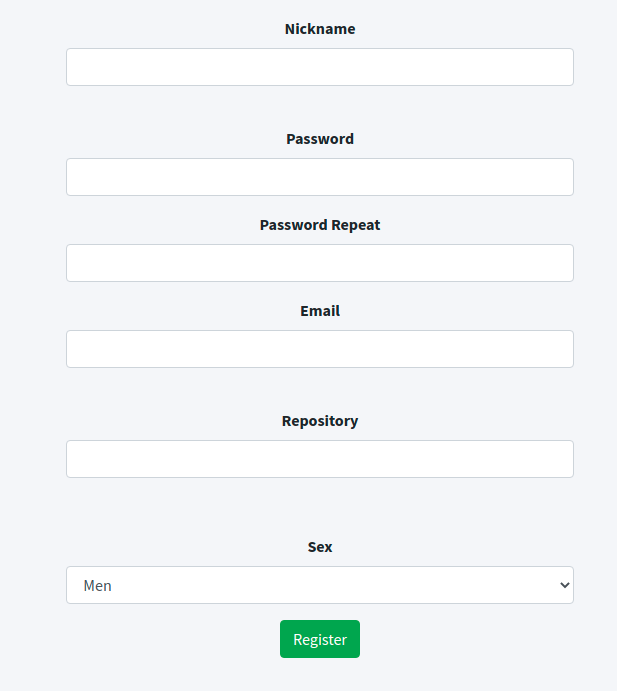

***
